# Zapret2 GUI — Архитектурные диаграммы
## Содержание

1. [Общая архитектура](#1-общая-архитектура)
2. [Диаграмма модулей и зависимостей](#2-диаграмма-модулей-и-зависимостей)
3. [Диаграмма классов (ядро)](#3-диаграмма-классов-ядро)
4. [Диаграмма последовательности: запуск DPI](#4-диаграмма-последовательности-запуск-dpi)
5. [Диаграмма последовательности: оркестратор](#5-диаграмма-последовательности-оркестратор)
6. [Диаграмма состояний: DPI процесс](#6-диаграмма-состояний-dpi-процесс)
7. [Диаграмма потоков: инициализация приложения](#7-диаграмма-потоков-инициализация-приложения)
8. [Структура стратегий](#8-структура-стратегий)
9. [Схема автозапуска](#9-схема-автозапуска)
10. [Схема DNS настройки (Win32 API)](#10-схема-dns-настройки-win32-api)
11. [Схема работы с файлом hosts](#11-схема-работы-с-файлом-hosts)
12. [Схема Premium подписки](#12-схема-premium-подписки)
13. [Схема Telegram интеграции](#13-схема-telegram-интеграции)
14. [Граф наследования UI компонентов](#14-граф-наследования-ui-компонентов)
15. [Схема сборки и распространения](#15-схема-сборки-и-распространения)

## 1. Общая архитектура

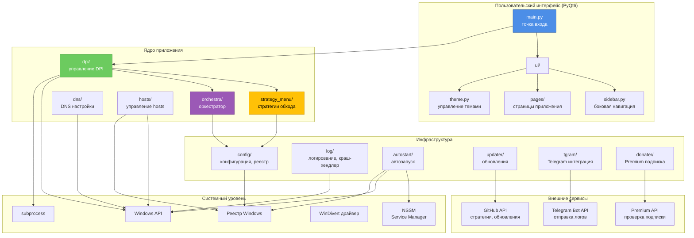

## 2. Диаграмма модулей и зависимостей

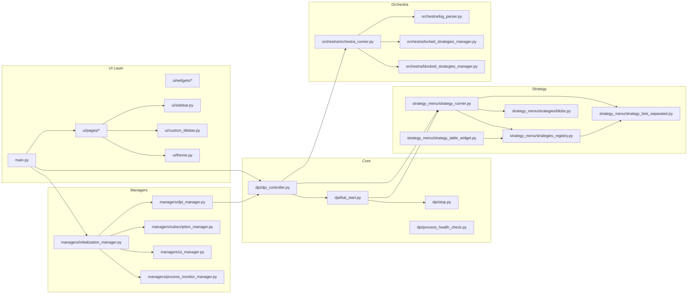

## 3. Диаграмма классов (ядро)

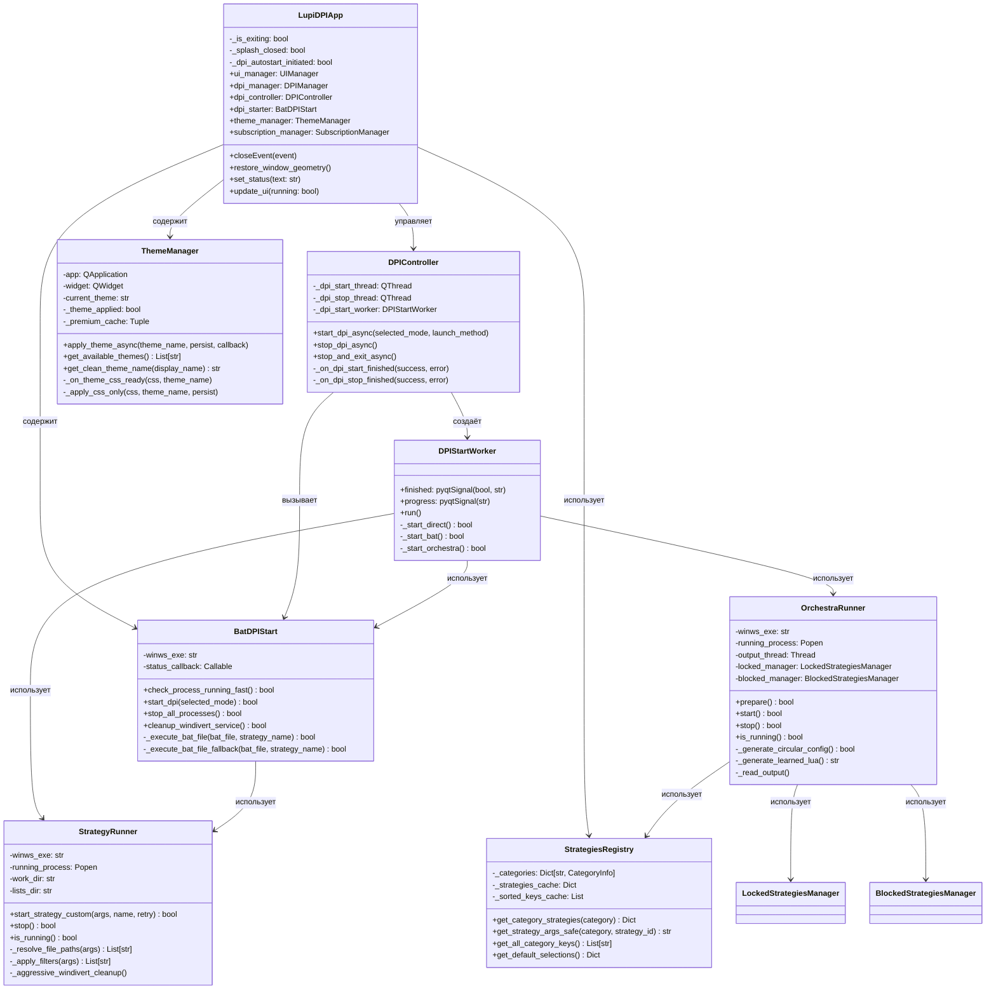

## 4. Диаграмма последовательности: запуск DPI

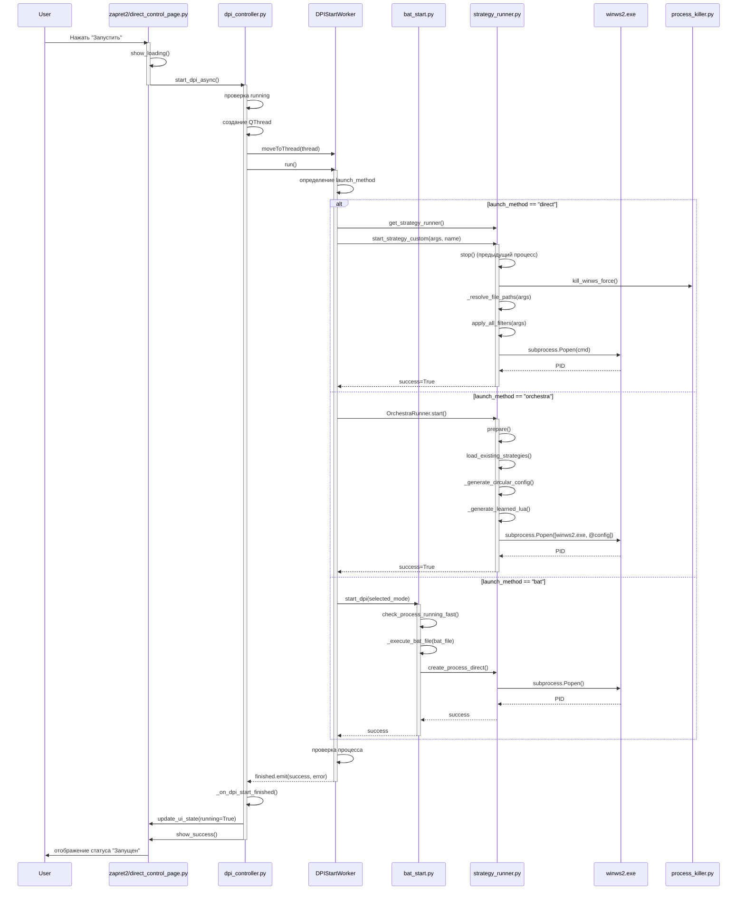

## 5. Диаграмма последовательности: оркестратор

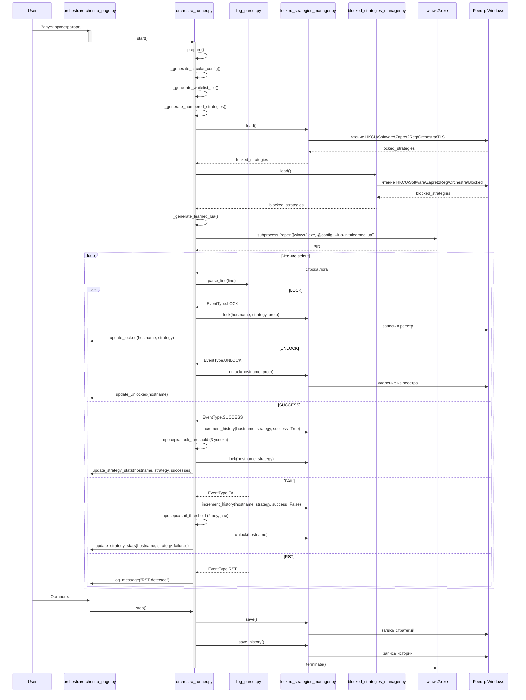

## 6. Диаграмма состояний: DPI процесс

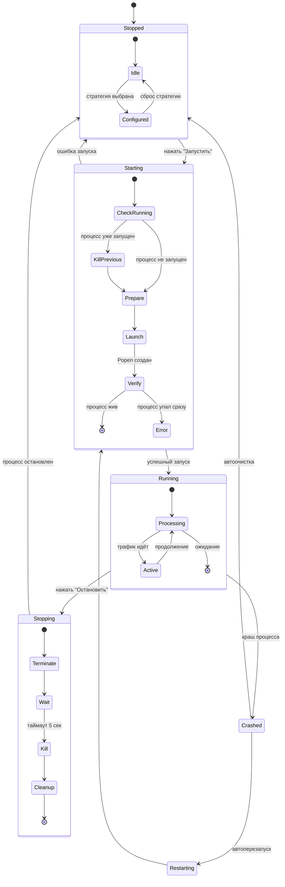

## 7. Диаграмма потоков: инициализация приложения

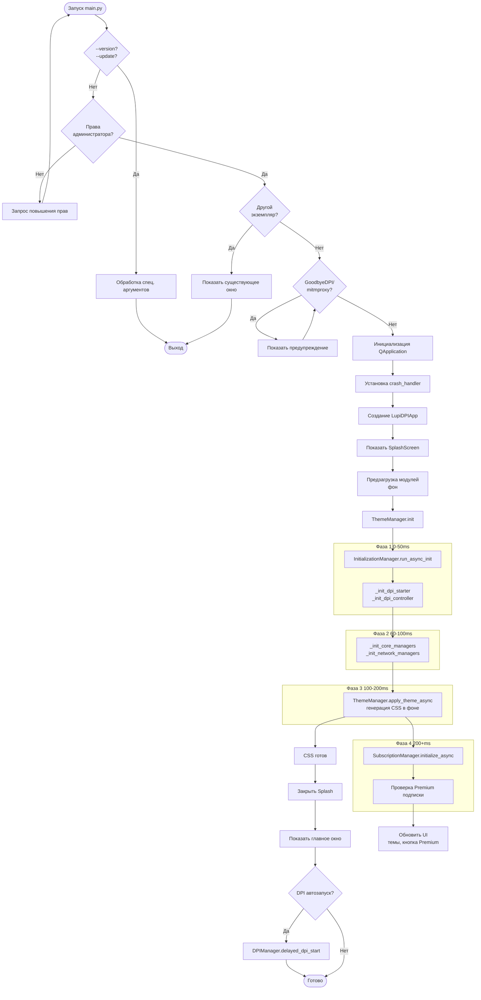

## 8. Структура стратегий

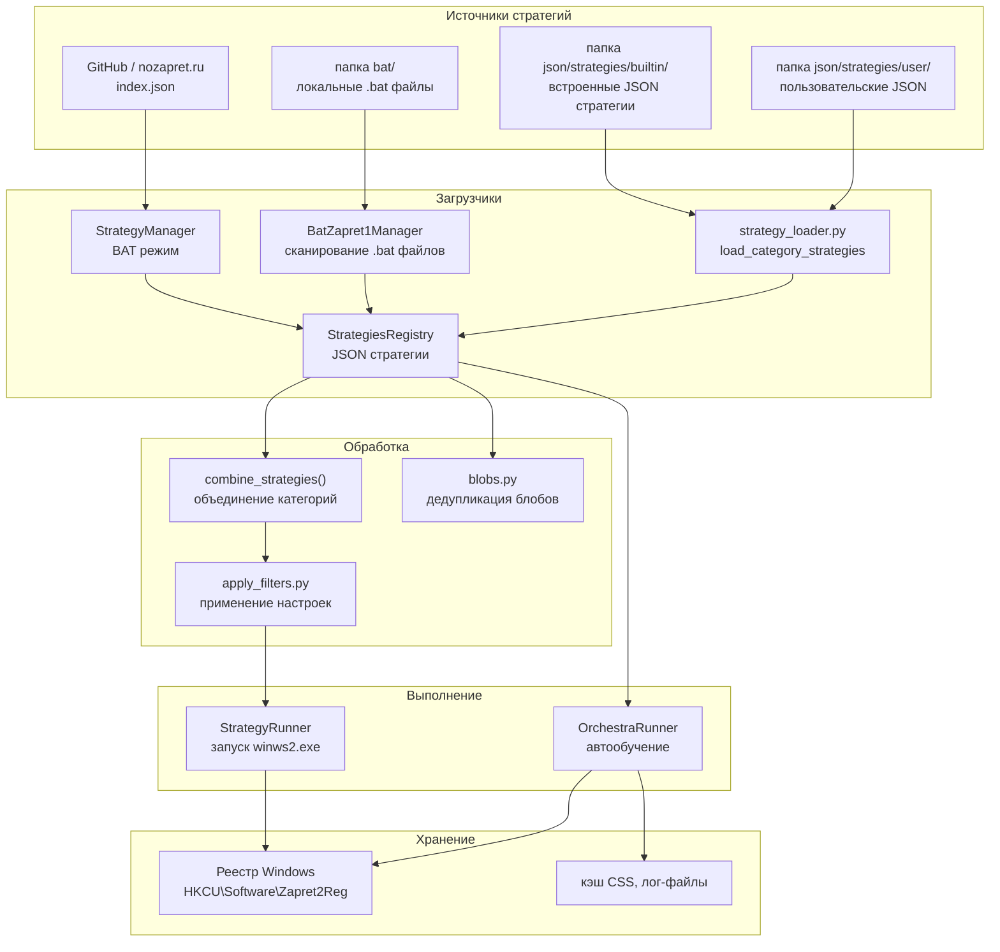

## 9. Схема автозапуска

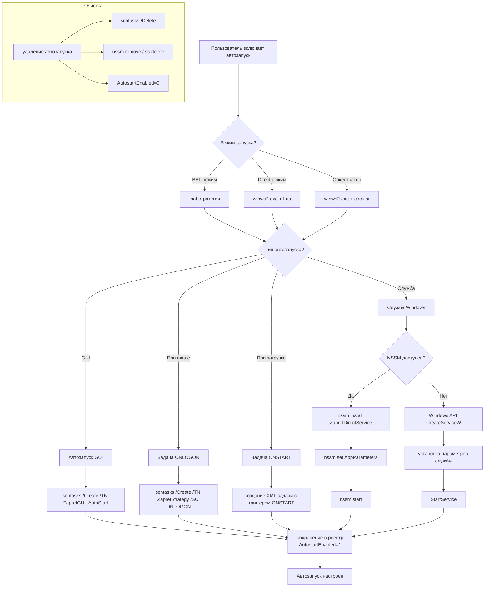

## 10. Схема DNS настройки (Win32 API)

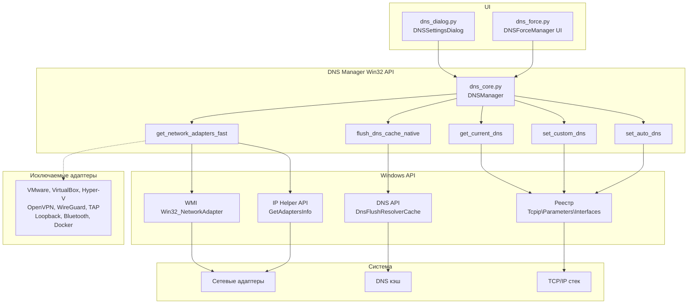

## 11. Схема работы с файлом hosts

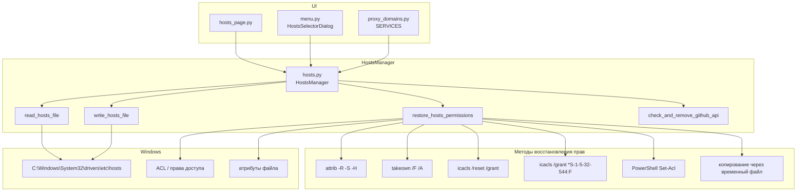

## 12. Схема Premium подписки

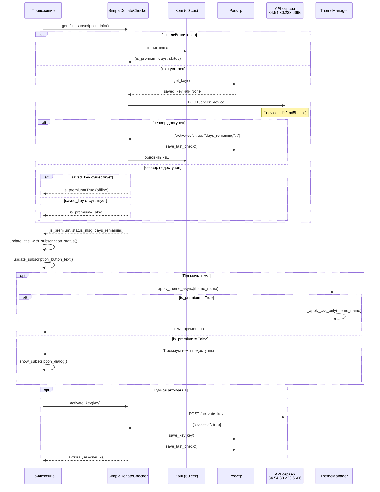

## 13. Схема Telegram интеграции

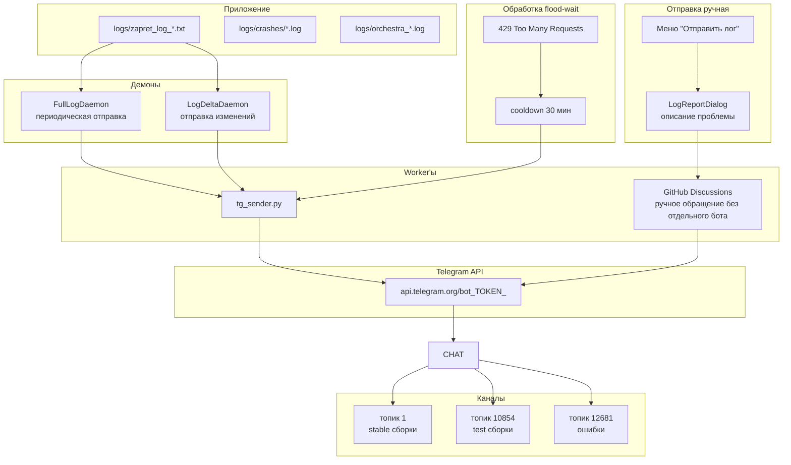

## 14. Граф наследования UI компонентов

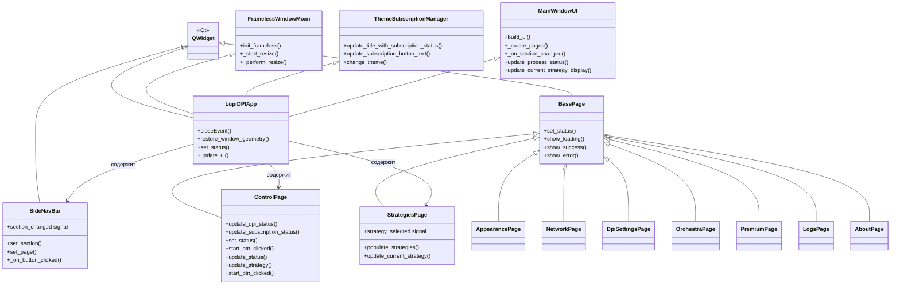

## 15. Схема сборки и распространения

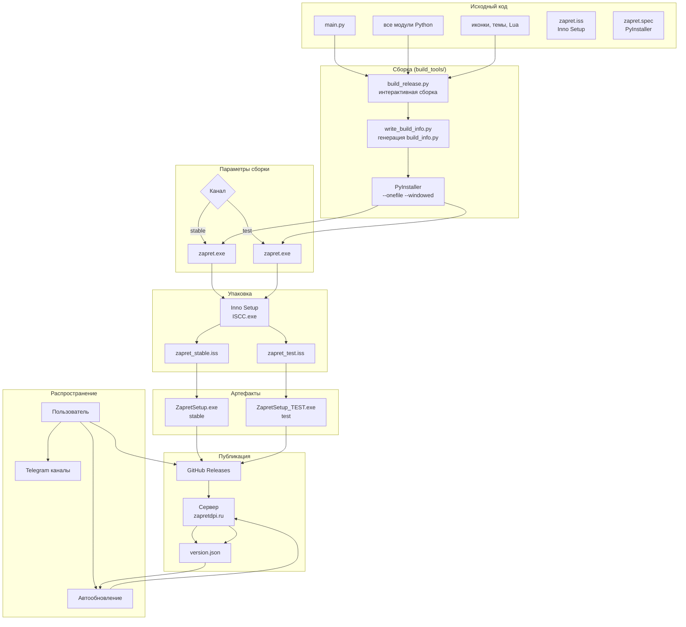
